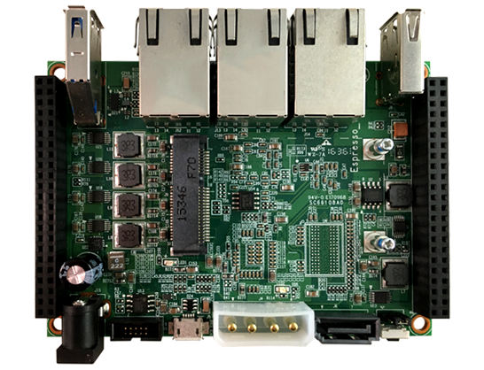
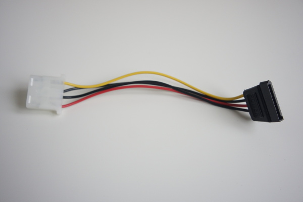
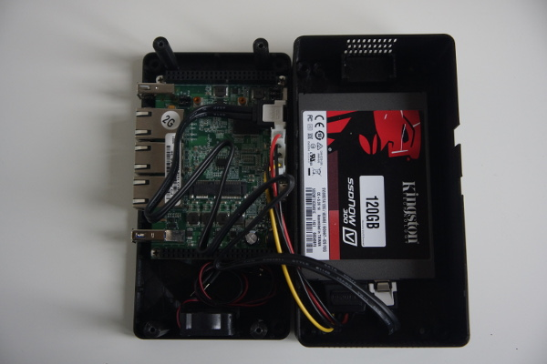
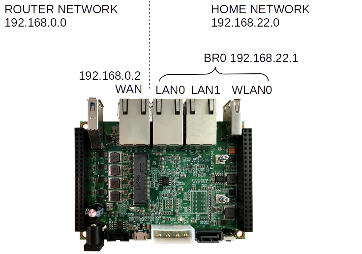
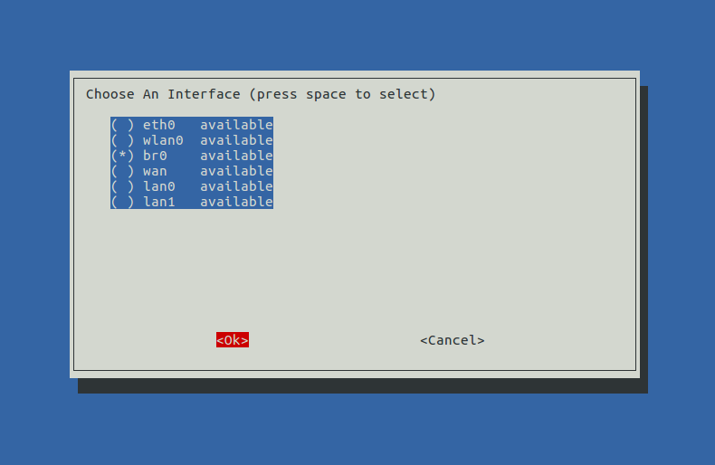
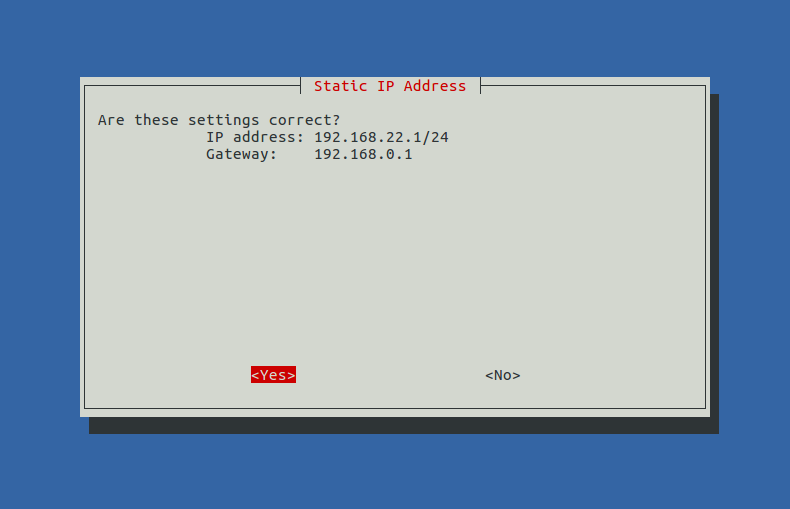
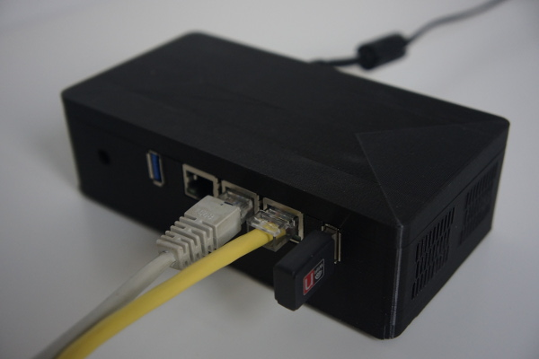

# ESPRESSO-hole: ESPRESSObin-based personal router with ad blocking.

This project was born as a solution to a set of requirements for a home box/router.

Hardware wish-list:
- gigabit router
- several (>2) ethernet ports
- external disk storage for server/media
- linux supported
- some USB ports

Network wish list:
- [PI-HOLE](https://pi-hole.net) ad-blocker
- traffic redirected through VPN
- WIFI access point
- media server

The [Marvell ESPRESSObin](http://espressobin.net) fits all these hardware requirements at the reduced price of [$49](https://www.globalscaletechnologies.com/p-72-marvell-espressobin.aspx). It includes 3 Ethernet Gigabit ports, USB 2 and 3 ports, and a SATA connector.



## Hardware setup

The ESPRESSObin is provided without power supply or case. I'm using an old router power supply, and a 3D printed case. An SSD disk -to reduce noise- is installed using the SATA connector, and WiFi capabilities are enabled using a WiFi dongle.


### External disk
The ESPRESSObin supports an external drive through a SATA connector. However, in v5 of the board the power connector is a molex-type connector (in v7 this has been replaced by a proper SATA power connector). An adaptor to SATA power can be easily done, and no soldering habilities are required.



### USB wireless

For wireless connection a USB WiFi dongle based on RT5370. Notice that not any dongle will work, or will be able to work in AP mode.

### 3D printed case
The ESPRESSObin comes without a case. A number of slutions are available, I specially like [this one](https://upon2020.com/blog/2017/12/3d-printable-box-for-the-espressobin-plus-a-hard-disk/). The [STL file](https://www.thingiverse.com/thing:2707086) provided includes the two parts together, so I provide a [folder](http://github.com/arturgs/espresso-hole/tree/master/case_3d_print) with two separated parts.

The case is designed with room for a 25mm fan like [this one](https://www.banggood.com/Hobbywing-5V-7V-150A-DC-Cooling-Fan-For-RC-Model-Motor-ESC-253040mm-Power-Transfer-p-1067266.html?rmmds=myorder&ID=47301&cur_warehouse=CN). On normal operation I find the fan too noisy and temperature levels have never been dangerous without the fan.




## Armbian installation
The ESPRESSObin is fully supported by [ARMBIAN](https://docs.armbian.com). Installation can be done easily [as explained here](https://www.armbian.com/espressobin/). The installation process can be controlled from a USB serial connection to a host computer running kermit using [this config file](files/kermit-usb0).

## Network configuration

The plan is to have an ESPRESSObin routing all the network traffic. The ESPRESSObin has 3 ethernet ports. A `wan` device is connected to the router, and two other devices `lan0` and `lan1` serve home traffic. The pi-hole is going to be in charge of serving DNS and DHCP, after segmentation of the home network.



An additional port `wlan0` is used by the WiFi dongle. These 3 inside ports `lan0`, `lan1` and `wlan0` are grouped in a bridge device. The router subnet `191.168.0.0` will be visible through `wan` device set at `192.168.0.2` fixed IP. The home network is now `192.168.22.0` and the bridge address is set to `192.168.22.1`. 

The network is configured using `/etc/network/interfaces`:
```
iface wan inet static
    address 192.168.0.2
    netmask 255.255.255.0
    network 192.168.0.0
    gateway 192.168.0.1

iface br0 inet static
    bridge_ports wlan0 lan0 lan1
    address 192.168.22.1
    netmask 255.255.255.0
    network 192.168.22.0
```

To reroute traffic from `br0` to `wan` we have to forward the traffic:
``` bash
echo 1 > /proc/sys/net/ipv4/ip_forward
```
and
```bash
iptables -t nat -A POSTROUTING -o wan -j MASQUERADE
```
In case we set up a VPN connection from the ESPRESSObin, the device name has to be replaced in the iptables entry, i.e. with a `tun0` device on the VPN:
```bash
iptables -t nat -A POSTROUTING -o tun0 -j MASQUERADE
```

### PI-HOLE installation

The PI-HOLE will take charge of virtually all inner network configuration. Any device getting DHCP configuration from the ESPRESSObin will have unwanted traffic blocked :)

Two important configuration fields have to be set in the pi-hole installer. The device used by the pi-hole is `br0` from the list. Also, the gateway used to route traffic to the internet is the router gateway `192.168.0.1`.





### Wireless AP service

The WiFi dongle creates a Wireless network using Hostapd. The network properties are defined in `/etc/hostapd.conf`:
```
ssid=ARMBIAN
interface=wlan0
hw_mode=g
channel=1

bridge=br0
driver=nl80211
ignore_broadcast_ssid=0
wmm_enabled=1
wpa=2
preamble=1

wpa_psk=********
wpa_passphrase=********
wpa_key_mgmt=WPA-PSK
wpa_pairwise=TKIP
rsn_pairwise=CCMP
auth_algs=1
macaddr_acl=0
```

## Media Server

Uploading some files to the ESPRESSObin and installing [PLEX](https://www.plex.tv) turns this box into a media server with web interface. Other options tested (i.e. OpenMediaVault) were not so compatible with other devices -TV or network speakers- running at home.


